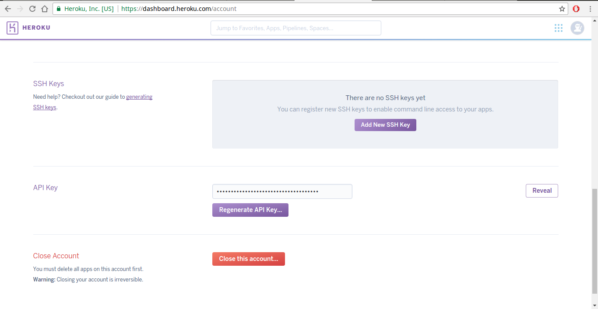
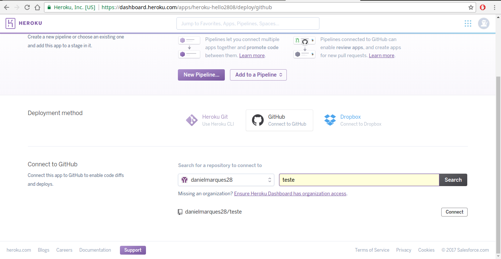
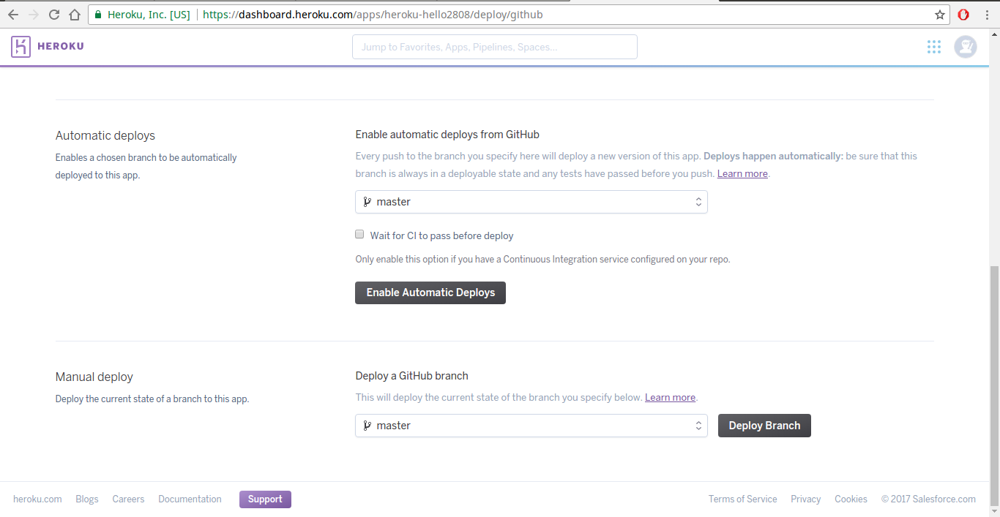
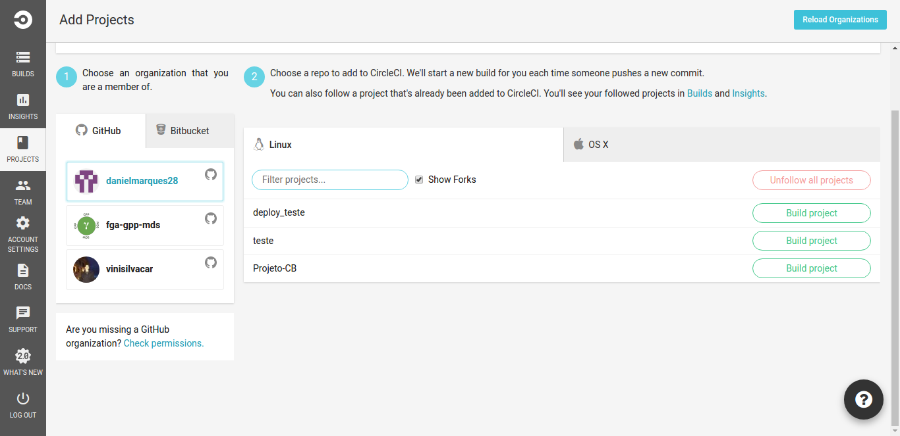

# Membros
15/0006101 - Ateldy Brasil  
15/0008228 - Daniel Marques  
15/0061382 - Kairon Velozo  
15/0064535 - Rodrigo Dadamos  

****

 

Fonte: [Soasta](https://www.soasta.com/solutions/continuous-load-testing/)

# Deploy Contínuo

É uma técnica ágil onde todo o código escrito para uma aplicação é colocado em produção de maneira imediata. Nessa técnica, toda vez que um commit passa nos testes automatizados da integração contínua, uma nova build é gerada e essa é colocada em produção.
O deploy contínuo é desempenhado como uma fase da integração contínua. Dessa forma, para a realização do deploy contínuo é necessário que a integração contínua esteja bem configurada, de forma que o código colocado em produção seja totalmente compatível com o que já está em produção.

# Benefícios

* Aumenta a produtividade geral pois integra equipes e processos numa pipeline unificada de deploy;
* Reduz o tempo de entrega de novas funcionalidades;
* Diminui riscos de problemas causados por grandes mudanças no código da aplicação;
* Automatiza tarefas repetitivas, de forma a aumentar o foco no desenvolvimento do produto;
* Antecipação do feedback do usuário para novas funcionalidades, possibilitando o uso de testes paralelos, técnica para determinar qual de duas features é preferida pelo usuário e/ou agrega mais valor à aplicação.

# Cases
O deploy contínuo é muito comum em empresas como Amazon, Facebook, onde dezenas de deploys são realizados diariamente.

### Amazon

A empresa Amazon é uma das maiores varejistas do mundo com serviços de nuvem. Ela realiza o deploy de um novo software a cada segundo. A Amazon apresenta uma arquitetura orientada a serviços. No entanto, embora isso ajude na organização para um desenvolvimento mais eficiente e centrado no cliente, a implantação é um ponto de complicação. Para automatizar o deploy, eles utilizam o projeto "Apollo", mecanismo de implantação baseado em SOA(Service-Oriented Architecture).
O serviço de implantação compartilhada em toda a empresa, automatiza as atualizações de software em servidores. "Os desenvolvedores poderiam definir seu processo de configuração de software para um único host, e a Apollo coordenaria essa atualização em toda uma frota de hosts", diz Vogels. Apollo agora lida com pelo menos 50 milhões de implantações anualmente para desenvolvimento, testes e produção de hosts anualmente.

### Facebook

O Facebook, visando o tamanho e o impacto que ele oferece atualmente, possui um departamento de release engineering desde 2008 com o objetivo de realizar uma liberação por dia como melhorias e novas funcionalidades. Com o novo escritório de engenharia em Londres, tinha como objetivo dobrar o número de deploys. O código pode ser liberado duas vezes por dia, mas isso é feito principalmente para correções de bugs e código interno.

# Ferramentas

### CircleCI

Plataforma de integração e delivery contínuo que ajuda times de desenvolvedores a lançarem código rapidamente automatizando os processos de build, teste e deploy.
[Site](https://circleci.com/)

### Jenkins

Ferramenta open source escrita em Java de integração contínua que pode ser usada para automatizar testes e deploy. 
[Site](https://jenkins.io/)

### Chef

[Site](https://www.chef.io/)

### Bamboo

Bamboo é um servidor de integração contínua da Atlassian.
[Site](https://br.atlassian.com/software/bamboo)

### Codeship

Codeship é um serviço de Integração Contínua que suporta projetos do GitHub, Bitbucket e Gitlab.
[Site](https://codeship.com/)

### Octopus Deploy

Feito para o desenvolvimento de ASP.NET.
[site](https://octopus.com/)

# Tutorial - Deploy Contínuo com Heroku e Rails

1. Se cadastre (ou faça login se já tiver uma conta) no site da ferramenta de deploy Heroku https://www.heroku.com/home.

2. Nas configurações da sua conta no Heroku (https://dashboard.heroku.com/account), vá até o topico “API Key”, clique no botão “Reveal” e copiei o campo de chave ao lado do botão.

3. Se cadastre (ou faça login se já tiver uma conta) no site da ferramenta de integração contínua CircleCI https://circleci.com/.

4. Nas configurações da sua conta (“Accounts Settings”) no CircleCI em Heroku API Key (https://circleci.com/account/heroku), cole a sua chave do Heroku e clique em “Save Heroku Key”.

5. Instale o aplicativo Heroku em seu Linux. Para Ubuntu e derivados basta adicionar o repo e instalar:

        $ sudo apt-get install software-properties-common # debian only

        $ sudo add-apt-repository "deb https://cli-assets.heroku.com/branches/stable/apt ./"

        $ curl -L https://cli-assets.heroku.com/apt/release.key | sudo apt-key add -

        $ sudo apt-get update

        $ sudo apt-get install heroku

6. Faça login no heroku do seu pc com o comando:

        $ heroku login

7. Crie um app no heroku:

        $ heroku apps:create <nome_do_app_no_heroku_aqui>

8. No site heroku vá até a dashboard de apps (https://dashboard.heroku.com/apps/), clique no app que foi criado no terminal.

9. Clique na aba “Deploy”, selecione a ferramenta de versionamento como GitHub em “Deployment method”, selecione o repositório desejado em “App connected to GitHub”.

10. Ative o deploy contínuo de uma determinada branch do seu repositorio em “Automatic deploys”, ative a checkbox “Wait for CI to pass before deploy” e clique no botão “Enable Automatic Deploys”.

11. Crie um arquivo na pasta do seu projeto chamado “circle.yml” com algum editor de texto, em seguida coloque dentro desse arquivo as configurações:

        deployment:
        staging:
        branch: master
        heroku:
          appname: <nome_do_seu_app_no_heroku_aqui>

12. Configure o arquivo “circle.yml” com os dados do seu projeto, adicione outras configurações e scripts se quiser.

13. No CircleCI na opção lateral “Projects” clique no botão “Add Project” (https://circleci.com/add-projects/gh/:org) e selecione seu repositório do GitHub que será feito a integração contínua e clique no botão ao lado “Build Project”.

14. Caso seu projeto use SSH, nas configurações do projeto vá no tópico “Permissions” e clique em “Checkout SSH Keys” e adicione a deploy key e a user key. Ainda no mesmo tópico clique em “SSH Permissions” e adicione a SSH key do seu repositório.

15. Pronto ! Ao commitar na branch escolhida para deploy haverá as mudanças automaticamente inseridas no Heroku.
